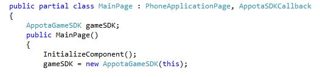
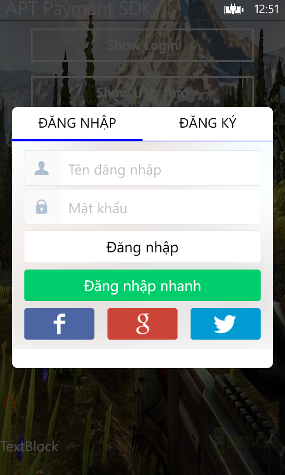
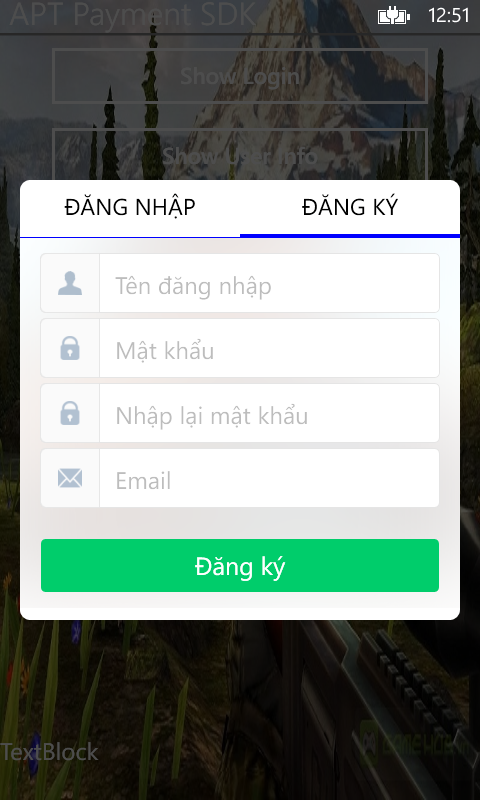
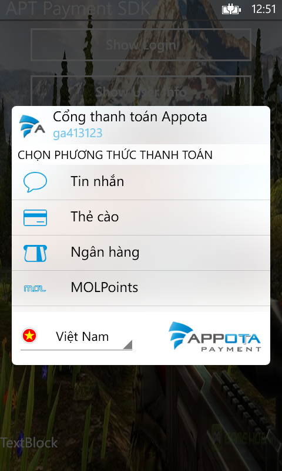
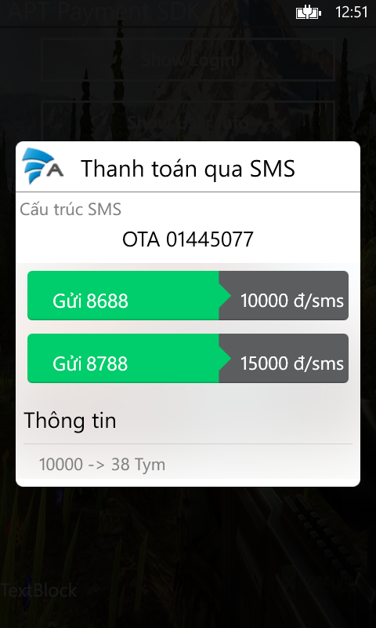
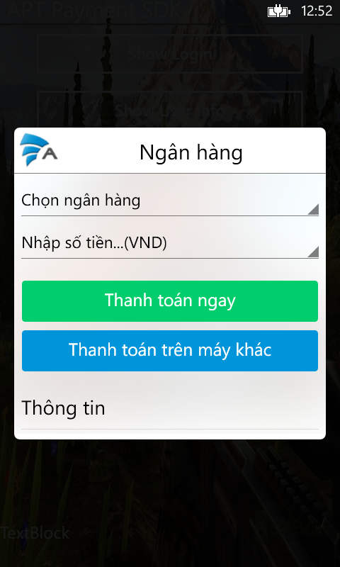
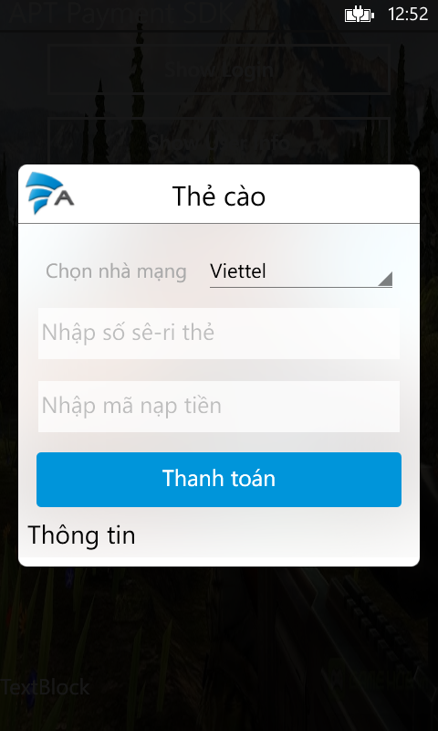

<head>
<meta content="en-us" http-equiv="Content-Language" />
<meta content="text/html; charset=utf-8" http-equiv="Content-Type" />
<title> WP8 payment SDK - Get Started </title>

<link href="../main.css" rel="stylesheet" type="text/css" />
<link href="../code.css" rel="stylesheet" type="text/css" />

</head>
<body>

<strong>Get Started</strong>

Appota Payment SDK cho Windows Phone là cách đơn giản nhất để tích hợp thanh toán cho ứng dụng của bạn trên hệ thống Appota. SDK này cung cấp giải pháp cho các hình thức thanh toán: SMS, thẻ cào, internet banking và paypal Payment.

<strong>Các bước tích hợp SDK:</strong>

1. Download và add SDK reference

2. Cấu hình SDK

3. Cấu hình JSON

4. Tích hợp

5. Chay SDK sample

&nbsp;

<strong>1. Add SDK reference</strong>

- Add thư viện thanh toán <strong>APTPaymentService.dll</strong> vào references của project.
- Trường hợp có sử dụng thanh toán bằng Paypal, cần download và add thêm Paypal sdk <strong>PayPal.Checkout.SDK-WindowsPhone8</strong>
- Trường hợp có sử dụng tài khoản twitter để login vào hệ thống, cần add thêm 2 thư viện <strong>Hammock.WindowsPhone</strong> và <strong>ICSharpCode.SharpZipLib.WindowsPhone</strong> (Đây là thư viện mặc định của Twitter sdk).

<strong>2. Cấu hình SDK</strong>

- Mở file <strong>WMAppManifest</strong> trong project, chuyển sang tab <strong>Capabilities</strong> tích vào mục <strong>ID-CAP-IDENTITY</strong>
- Add file <strong>AppotaConfig.xml</strong> vào project. File này chứa các thông số để cấu hình SDK.
	
> - Key lấy từ trang dev.appota.com:

		<apiKey>Replace with your apiKey</apiKey>
		<apikeySandbox>Replace with your Sanbox ApiKey<apikeySandbox>
		<testSandbox>false</testSandbox>

	
> - Notify Url : url hệ thống sẽ gọi sau khi thanh toán thành công

	 <notifyUrl>Replace with your notify Url</notifyUrl>
	
> - Config Url : url của file json config.	 Xem phần <strong>3.Cấu hình JSON</strong>

	<configUrl>http://appvn.com/payment-winphone.php</configUrl>

> - Để sử dụng tài khoản facebook đăng nhập, thêm các thông số:

	 <facebookAppId>Replace with facebookAppId</facebookAppId>
  	 <facebookClientSecret>Replace with facebookClientSecret</facebookClientSecret>
	
> - Để sử dụng tài khoản Google đăng nhập, thêm các thông số:
 
	<googleClientID>Replace with googleClientID</googleClientID>
	<googleClientSecret>Replace with googleClientSecret</googleClientSecret>
	
> - Để sử dụng tài khoản Twitter đăng nhập, thêm các thông số:
 
	<twitterConsumerKey>Replace with twitterConsumerKey</twitterConsumerKey>
	<twitterConsumerKeySecret>Replace with twitterConsumerKeySecret</twitterConsumerKeySecret>
	

<strong>3. Cấu hình JSON</strong>

Appota Game SDK cung cấp một phương thức cấu hình tiện lợi với nhiều tùy chọn cho nhà phát triển. Bạn cần thực hiện các bước sau để sử dụng phương thức này:

- Sử dụng công cụ JSON Generator để tạo ra file JSON chứa các cấu hình
 ([https://developer.appota.com/sdktool.php](https://developer.appota.com/sdktool.php "https://developer.appota.com/sdktool.php")).
- Upload file cấu hình JSON lên một host có thể truy cập được.
- Thêm url json vào thẻ `<configUrl>` của file cấu hình <strong>AppotaConfig.xml</strong>

<strong>4. Tích hợp SDK</strong>

Khai báo: AppotaGameSDK gameSDK;

Khởi tạo: gameSDK = new AppotaGameSDK(<a href="#AppotaSDKCallback">AppotaSDKCallback</a> _callBack);

Các phương thức SDK hỗ trợ:

	- gameSDK.ShowUserInfo(); // Show user info UI
	- gameSDK.MakePayment(); // Show payment UI
	- gameSDK.SwitchAccount(); // Switch between accounts
	- gameSDK.LogoutAccount(); // Logout account

<strong><a name="AppotaSDKCallback">AppotaSDKCallback</a></strong> là giao diện (interface) để nhận các hàm callback từ SDK như LoginCallback hoặc PaymentCallback.

    public interface AppotaSDKCallback
    {
        void onPaymentSuccess(TransactionResult result);
        void onPaymentError(String message);

        void onUserLoginSuccess(UserLoginResult result);
        void onUserLoginError(string message);

        void onUserRegisterSuccess(UserLoginResult result);
        void onUserRegisterError(string message);
    }

<strong>5. Project SDK Sample</strong>

Xem thêm sample code được kèm theo bộ SDK để thêm chi tiết.

1 số hình ảnh SDK sample:

&nbsp;&nbsp;

&nbsp;&nbsp;

</body>

</html>
